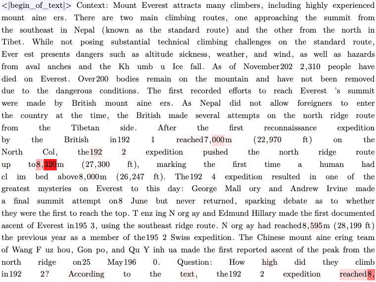

# LeXplaiNet

LeXplaiNet (**LRP eXplains neural Networks**) is a research-oriented PyTorch
repository for studying, implementing, and visualizing **Layer-wise Relevance
Propagation (LRP)**. It supports two complementary implementation styles:

- **Implicit LRP** keeps the ordinary model interface and changes the backward
  behavior of selected modules. A regular autograd pass then exposes relevance
  as input × modified gradient.
- **Explicit LRP** represents propagation rules directly with custom modules and
  `torch.autograd.Function`, making the redistribution steps easier to inspect.

The repository contains examples for convolutional networks and transformers,
model canonization utilities, signed image and token heatmaps, and checks for
forward preservation and relevance conservation. It is experimental research
code: rules, targets, bias handling, and canonization are methodological choices,
not interchangeable implementation details.

## Repository overview

```text
lexplainet/
├── implicit/    # Forward patches and implicit LRP rules
├── explicit/    # Explicit modules, rules, and model wrappers
└── heatmap/     # Image and token visualization

tutorials/       # End-to-end vision, transformer, and CRP examples
```

## Setup

LeXplaiNet is currently used directly from the repository rather than installed
as a released Python package.

```bash
git clone https://github.com/erfanhatefi/LeXplaiNet.git
cd LeXplaiNet

python -m venv .venv
source .venv/bin/activate
python -m pip install torch torchvision numpy pillow matplotlib
```

Run scripts and notebooks from the repository root so that `lexplainet` is on
Python's import path. Transformer tutorials may require additional packages such
as `transformers`, depending on the selected model.

## Implicit LRP: minimal ResNet-18 example

The implicit implementation patches selected module `forward` methods. Their
numerical forward values are preserved by the LRP proxy operations, while
autograd follows the rule-specific backward path. For a selected score $f_t$,
the input relevance is read as

$$
R(x) = x \odot \frac{\partial \widetilde{f}_t}{\partial x},
$$

where $\widetilde{f}_t$ has the original forward value but the modified backward
behavior defined by the composite.

The following example explains the top-scoring ImageNet logit for one image:

```python
import matplotlib.pyplot as plt
import torch
from PIL import Image
from torchvision.models import ResNet18_Weights, resnet18

from lexplainet.implicit.composite_core import patch_composite, undo_patch_all
from lexplainet.implicit.model_specific_patches import canonize_resnet
from lexplainet.implicit.rules import (
    epsilon_rule_non_zero,
    identity_rule,
    zplus_rule,
)


device = torch.device("cuda" if torch.cuda.is_available() else "cpu")

# 1. Load a pretrained model and its matching ImageNet preprocessing.
weights = ResNet18_Weights.DEFAULT
model = resnet18(weights=weights).eval().to(device)
preprocess = weights.transforms()

# 2. Fold BatchNorm parameters into adjacent convolutions for LRP.
canonize_resnet(model)

# 3. Choose how each layer type redistributes relevance.
composite = {
    torch.nn.Conv2d: (zplus_rule, {"ignore_bias": True}),
    torch.nn.Linear: (
        epsilon_rule,
        {"epsilon": 1e-6, "ignore_bias": True},
    ),
    torch.nn.ReLU: (identity_rule, {}),
}
patch_composite(model, composite)

# Model parameters are fixed; only the input requires a gradient.
for parameter in model.parameters():
    parameter.requires_grad_(False)

# 4. Preprocess one image into [batch, channels, height, width].
image = Image.open("assets/dog_1.png").convert("RGB")
model_input = preprocess(image).unsqueeze(0).to(device)
model_input.requires_grad_(True)

# 5. Select one output score and propagate relevance from that target.
model.zero_grad(set_to_none=True)
logits = model(model_input)
target_index = logits.argmax(dim=1).item()
logits[0, target_index].backward()

# Sum channel-wise relevance into one signed spatial heatmap.
input_relevance = model_input.detach() * model_input.grad.detach()
heatmap = input_relevance.sum(dim=1)[0].cpu()

target_name = weights.meta["categories"][target_index]
color_limit = heatmap.abs().quantile(0.99).clamp_min(1e-12).item()

plt.imshow(heatmap, cmap="bwr", vmin=-color_limit, vmax=color_limit)
plt.title(f"LRP for: {target_name}")
plt.axis("off")
plt.colorbar(label="relevance")
plt.show()

# Optional cleanup: this removes rule patches, but not ResNet canonization.
undo_patch_all(model)
```

Red and blue indicate positive and negative relevance for the **selected logit
under this composite**. They do not, by themselves, establish causality. Changing
the target, rule, stabilizer, bias treatment, or canonization can change the map.

`patch_composite` modifies the model in place. `undo_patch_all(model)` removes
the forward patches, but it does not undo model canonization; reload the original
weights when an untouched model is required.

For a fuller example, see
[the ResNet and EfficientNet implicit-LRP tutorial](tutorials/tutorial_1_explain_resnet_efficientnet_implicit_lrp.ipynb).

## Explicit implementation

The explicit implementation constructs LRP-aware modules and wrappers whose
backward operations directly encode the redistribution equations. It is more
verbose and architecture-specific, but useful when the individual propagation
steps should be visible and testable.

Start with
[the explicit ResNet tutorial](tutorials/tutorial_0_explain_resnet_explicit_lrp.ipynb).
Transformer and conditional-relevance examples are available in the other
notebooks under [`tutorials/`](tutorials/).

## Example explanations

### Vision


### Language



## Acknowledgements and upstream projects

Some modules in LeXplaiNet were adapted from, and many implementation ideas were
inspired by, the following projects:

- [LXT — LRP eXplains Transformers](https://github.com/rachtibat/LRP-eXplains-Transformers),
  by Reduan Achtibat and collaborators.
- [Zennit](https://github.com/chr5tphr/zennit),
  by Christopher J. Anders and contributors.

We gratefully acknowledge both projects and their authors. Please cite the
corresponding upstream projects and papers when their modules or methods
contribute to published work.

### Third-party licensing

Code adapted from LXT or Zennit must retain its upstream copyright and license
notices. Attribution in this README does not replace the obligation to distribute
the applicable license texts.

Before publishing LeXplaiNet, add the full upstream license texts and select a
compatible top-level license for original LeXplaiNet code. The repository does
not currently declare one.
